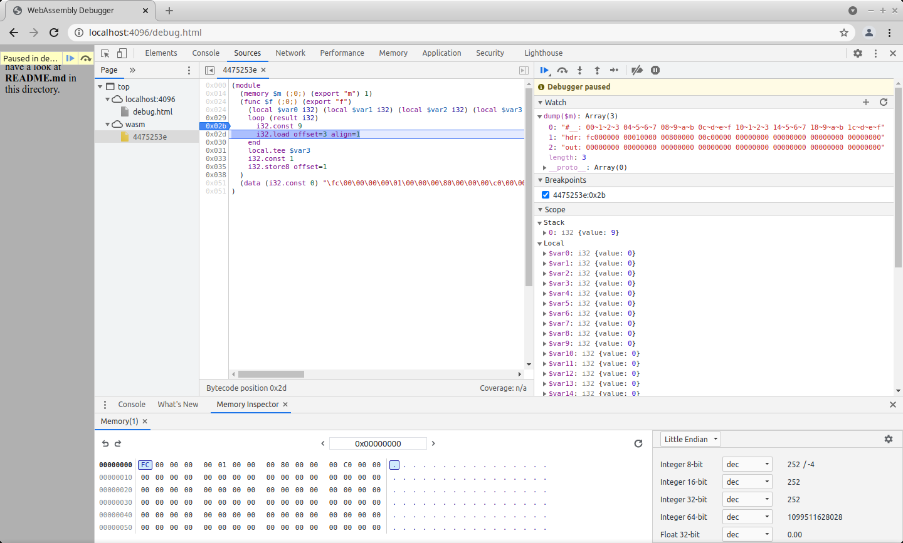

## Instructions for running the WebAssembly debugger

For Codelings this is really useful way of gaining a better understanding about 
what the code is doing.

The best tool right now (March 2021) is Chrome because it shows the WebAssembly 
values stack and, if you have access to version 89+, it also has a Memory 
Inspector.

If you follow the instructions in this file, you should be able achieve 
something close to what's shown in the following screenshots:




###Symlink the `wasm` file you want debug to `debug/debug.wasm`

If you do not have a `wasm` file you would like to debug, you can skip this 
step and use the sample `debug.wasm` file.

If you have `wasm` file you want to debug:

```bash
cd debug
mv debug.wasm debug.wasm.bak
ln -s path/to/you/file.wasm debug.wasm
```

####Start the HTTP server

```bash
cd debug
$ ./http_server.py
```

####Start the debugger

Go to the following URL:

http://localhost:4096/debug.html

Open developer tools:

- In the desktop version of Chrome, this is <b>Ctrl+Shift+I</b> or Menu (three 
vertical dots in the top right corner) > More Tools > Developer tools

- In the desktop version of Firefox, this is <b>Ctrl+Shift+Z</b> or Menu (three 
dashes in the top right corner) > Web developer > Debugger

Hard-reload the page (left-click on the Reload button while holding the 
`Shift` button)

Find the `wasm` file among the sources and click on it. You should now see 
some WebAssembly code.

Toggle a breakpoint on one of the lines by clicking on the hex address on the 
left

Reload the page

The debugger should now be paused on the breakpoint. You can press F11 to step 
through the program. In Firefox you should be able to see the current value of 
the 16 local variables, most of them zero. In Chrome, you should also be able 
to see the WebAssembly value stack. 


####Add the watch expression

The expression dumps a few key stretches of WebAssembly memory. If you feel 
like customising the JavaScript code for `dump()`, it's in `debug.html`.

The watch expressions to use are as follows:

```js
dump(memory0)  // Google Chrome
dump($m)       // Firefox
```


####Launch the Memory Inspector

The following only works in Chrome (sadly no Firefox equivalent) and only in 
version 89+, which as of March 2021 was only available from the developer beta 
channel (which is publicly accessible without the need for any sign-ups) -

Enable WebAssembly debugging via DevConsole > Settings (cogged wheel) > 
Experiments => (tick) WebAssembly Debugging: ...,

and then right-click on Module > $m Memory(1) > Inspect memory
